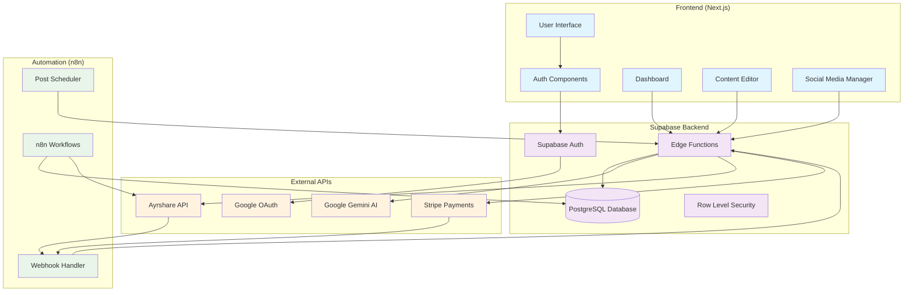

# System Architecture Design

## Overview
This document outlines the system architecture for a social media management platform with AI-powered content generation, built using Next.js, Supabase, and various third-party APIs.

## Architecture Diagram (Mermaid)

## Component Relationships

### 1. Frontend Layer (Next.js)
- **User Interface**: Main application interface with responsive design
- **Authentication Components**: Google OAuth integration via Supabase Auth
- **Dashboard**: User management interface for content, analytics, and billing
- **Content Editor**: AI-powered content creation with Gemini integration
- **Social Media Manager**: Multi-platform posting and scheduling interface

### 2. Backend Services (Supabase)
- **Supabase Auth**: Handles user authentication, session management, and OAuth flows
- **PostgreSQL Database**: Stores user data, content, social accounts, and subscription info
- **Edge Functions**: Serverless functions for API integrations and business logic
- **Row Level Security**: Database-level security for multi-tenant data isolation

### 3. External APIs
- **Google OAuth**: User authentication and authorization
- **Google Gemini**: AI-powered content generation and optimization
- **Ayrshare**: Multi-platform social media posting and management
- **Stripe**: Payment processing and subscription management

### 4. Automation Layer (n8n)
- **Workflows**: Automated processes for content scheduling and posting
- **Post Scheduler**: Time-based triggers for scheduled social media posts
- **Webhook Handler**: Processes webhooks from external services

## Data Flow Mapping

### Authentication Flow
1. User clicks "Sign in with Google" → Frontend
2. Frontend initiates OAuth → Supabase Auth
3. Supabase Auth redirects → Google OAuth
4. Google returns authorization code → Supabase Auth
5. Supabase creates/updates user → PostgreSQL Database
6. Session token returned → Frontend

### Content Creation Flow
1. User enters prompt → Content Editor
2. Frontend sends request → Edge Function (content-generation)
3. Edge Function calls → Google Gemini API
4. Generated content returned → Edge Function
5. Content saved → PostgreSQL Database
6. Content displayed → Frontend

### Social Media Posting Flow
1. User schedules post → Social Manager
2. Post data saved → PostgreSQL Database (scheduled_posts)
3. n8n monitors → scheduled_posts table
4. When due, n8n triggers → Edge Function (social-post)
5. Edge Function calls → Ayrshare API
6. Post status updated → PostgreSQL Database

### Payment Flow
1. User selects plan → Frontend
2. Stripe Checkout initiated → Stripe
3. Payment processed → Stripe Webhook
4. Webhook received → Edge Function (stripe-webhook)
5. Subscription updated → PostgreSQL Database
6. User entitlements updated → Database

## Security Boundaries

### Frontend Security
- HTTPS enforcement
- Client-side input validation
- Secure token storage via Supabase SDK
- Content Security Policy (CSP)

### Backend Security
- Row Level Security (RLS) policies
- API key protection in Edge Functions
- Webhook signature verification
- Rate limiting on API endpoints

### Database Security
- Encrypted connections (SSL/TLS)
- Row-level security policies
- Audit logging
- Regular backups with encryption

### External API Security
- API keys stored as environment variables
- OAuth token encryption
- Request signing for webhooks
- Rate limiting compliance

## Scalability Considerations

### Performance Optimizations
- **Frontend**: Next.js SSR/SSG, image optimization, code splitting
- **Database**: Proper indexing, connection pooling, read replicas
- **Edge Functions**: Serverless auto-scaling, connection reuse
- **Caching**: Redis for session data, CDN for static assets

### Bottleneck Identification
- **Database queries**: Monitor slow queries, implement pagination
- **External API limits**: Implement rate limiting and retry logic
- **Edge Function cold starts**: Keep functions warm with scheduled pings
- **Large file uploads**: Use direct S3 uploads with presigned URLs

### Scaling Strategies
- **Horizontal scaling**: Supabase auto-scales database and functions
- **Load balancing**: Vercel/Netlify handle frontend scaling
- **Database sharding**: Partition by user_id for large datasets
- **Microservices**: Split complex workflows into smaller functions

## Monitoring and Observability

### Logging Strategy
- **Application logs**: Structured logging with correlation IDs
- **Database logs**: Query performance and error tracking
- **API logs**: Request/response logging with sensitive data masking
- **Security logs**: Authentication attempts and access patterns

### Metrics Collection
- **Performance metrics**: Response times, throughput, error rates
- **Business metrics**: User engagement, content generation, post success rates
- **Infrastructure metrics**: Database connections, function invocations
- **Cost metrics**: API usage, storage consumption, compute costs

### Alerting
- **Error rate thresholds**: >5% error rate triggers alert
- **Performance degradation**: >2s response time alert
- **Security events**: Failed authentication attempts
- **Business critical**: Payment failures, API quota exceeded